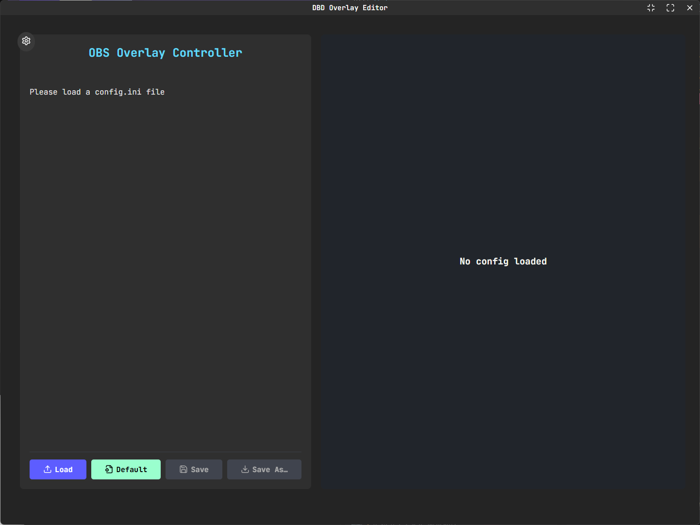
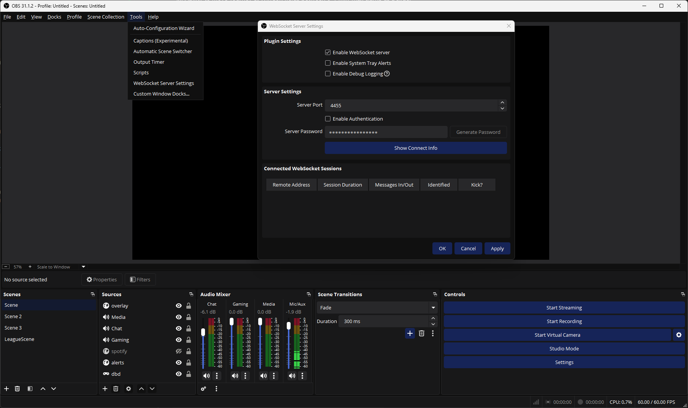
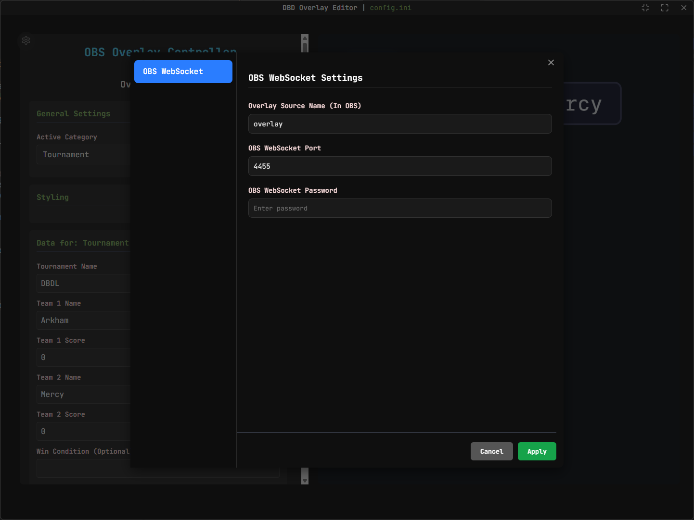
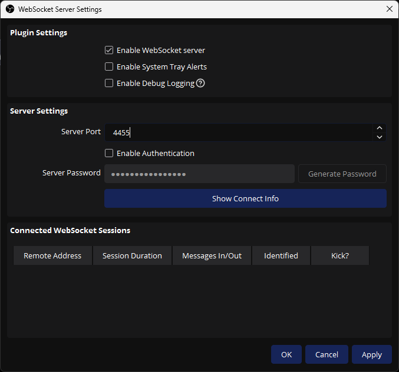

# TODOs

- [x] Settings Panel
- [x] WebSocketry for OBS
  - [x] Settings option for OBS WS data (port, sourceName, ?password)
- [x] Ability to move Tourney & WinCon fields between 0-1 min-max clamp as a slider
  - [ ] FIXME: the slider should clamp back to the closest edge if `teams` div shortens
- [x] Slider for scale of final overlay
- [ ] Independent styling options
- [ ] Help / Tutorial

# How to use?

Go into the [releases page]() and download the most up-to-date version, download the `.msi` installer and launch the installer. Then run the application. Its name is `DBD OBS Overlay`.

Once you launch the app, you will be greeted to this screen: 

If you don't want to customize a separate `.ini` config, you should click `Default`, and it will (create if it needs to) and load the default `config.ini` located in `%LOCALAPPDATA%/dbd-overlay-config/`.

After that, you can switch categories (current supported ones are: `Tournament`, `1v1`, `Scrims` & `Winstreak`) and edit their respective fields. However, the styling options are global. Keep this in mind: if you edit the styling for `1v1`, it will transfer onto the rest. **This is a WIP to have them all possess their own unique styling options.**

**The application itself serves the overlay at ``http://localhost:4000/overlay``, so this is what you'll add into your OBS browser source**.

In order for the application to work seemlessly, and if you'd prefer not to do any additional work afterwards, I highly recommend you take a minute to set up OBS WebSockets. First what you're going to do is launch OBS, then go into `Tools -> WebSocket Server Settings` and turn on `Enable WebSocket Server` **AND DISABLE AUTHENTICATION!!**:

After that, you're going to go back into the editor application and click the settings icon (cog wheel in the top left). You will be met with the following screen:

Here, you will want to put the **_exact_** name of the browser source you have in OBS, for example, in mine it is `overlay`. **Be sure to pay attention to any capitalisation!**. And for `OBS WebSocket Port`, put the port that shows up in your `OBS WebSocket Server Settings`:

Click `Apply` on both editor settings and OBS WS settings. And that's it! Now you can edit your default configuration as much as you'd like, and you can save it, and these changes will be reflected onto your OBS source every time.

**Of course, if you load a completely different `.ini` file (i.e. you have multiple layouts for different leagues), you can simply load that `.ini` file and the overlay will serve it.**