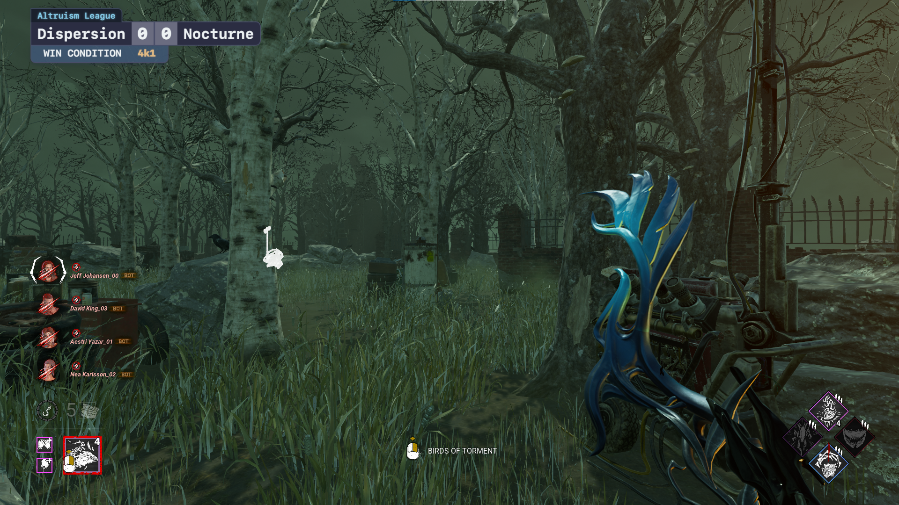

# What is this for?

This is an OBS overlay for DBD streamers to use to display information when they're playing a tournament, scrim night, or just scrimming regularly.

## How to use?

Download the project either via `Download as Zip` or `git clone` the repository. I'd recommend cloning it as you can stay up-to-date without having to constantly juggle ZIP files and directories.

FIRST, run the binary inside of `bin` directory. This will server a local HTTP server so the application can read from `config.ini` (because OBS doesn't really support the `file://` protocol). 

Next, you will want to go into OBS, create a `Browser Source`, and paste in the following: `http://localhost:8000/overlay.html`. Then you're all good to go.

Now, in order to change the settings of how the overlay displays, you'll find a `config.ini` file within the project. This is what _you_ as the user will be altering. It's broken down into multiple categories:

## CategoryInit

This category consists of a single property: `DesiredCategory`. The available options for this are as follows:

- `1v1`
- `Scrims`
- `Tournament`
- `Winstreak`

If you have any suggestions for which categories I might've missed, let me know! However, if for example you want to do a `DuoQ Streak` overlay, you can simply change `Winstreak.TeamName` to `DuoQ Streak` and that should suffice! So please avoid recommending me things that are, _technically_, feature-complete by design.

## Tournament

Properties here should be self-explanatory, but I will list them in any case:

- `TournamentName`
- `FirstTeamName`
- `FirstTeamScore`
- `SecondTeamName`
- `SecondTeamScore`
- `?WinCondition`

The reason there's a `?` at the beginning of `WinCondition` (in this small documentation ONLY, the property in the `.ini` file will not include it) is because that means it's marked as an "optional" property, meaning, that you can leave it blank and the program will understand that it shouldn't render a win condition since one hasn't been set yet. If a property (again, solely in this documentation) does not have a `?` at the beginning, that means it is mandatory to fill out.

## Scrims

Only one property:

- `TeamOrKillerName`

## 1v1

- `FirstPlayerName`
- `FirstPlayerScore`
- `SecondPlayerName`
- `SecondPlayerScore`
- `?WinCondition`

## Winstreak

- `TeamName`
- `CurrentScore`
- `?PersonalBest`

And that is all! I hope you enjoy this little overlay. All users are free to modify, send contributions and of course incorporate the software into their own applications as they please.

